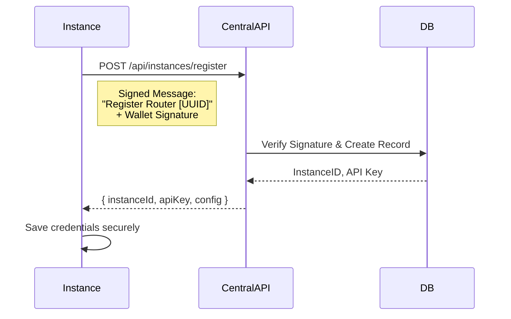
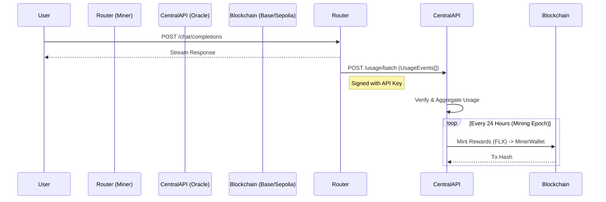
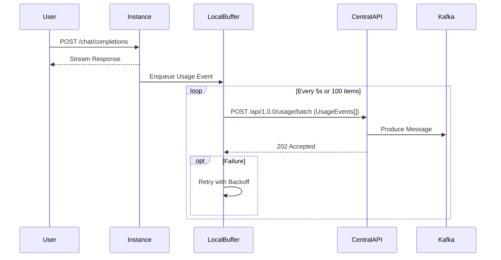
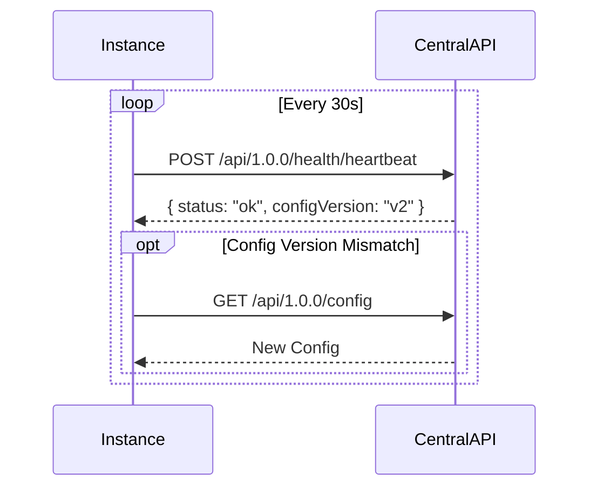

# Communication Design

## 1. Instance Registration Flow
**Goal**: Securely onboard a new Router Instance.



## 2. Usage Reporting & Mining Flow (Async)
**Goal**: Report usage and earn Mining Rewards (FLX Tokens).





- **Payload Structure**:
  ```json
  {
    "instanceId": "uuid",
    "batchId": "uuid",
    "events": [
      {
        "timestamp": "ISO8601",
        "provider": "openai",
        "model": "gpt-4o",
        "tokens": { "input": 100, "output": 200 },
        "cost": 0.004,
        "metadata": { "userId": "user_123" }
      }
    ]
  }
  ```

## 3. Health & Heartbeat Flow
**Goal**: Monitor instance availability.
**Direction**: Outbound (Instance -> Central) to avoid firewall issues.




