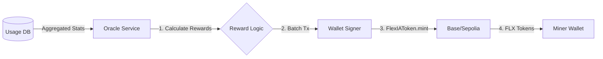

# Oracle Service Design

## 1. Overview
The **Oracle Service** is a specialized component within the Control Center responsible for bridging the "Web2" world (off-chain usage databases) with the "Web3" world (on-chain Smart Contracts). It ensures that Miners (Routers) are accurately rewarded with `FlexIAToken` (FLX) for the work they perform.

## 2. Architecture

### 2.1 The "Bridge" Flow
1.  **Off-Chain Data**: `instance_usage_events` table (Postgres). Verified usage logs from Routers.
2.  **The Oracle (Cron Job/Service)**:
    -   Reads aggregated usage (e.g., "Miner A used 10k tokens today").
    -   Calculates reward: `Reward = Usage * Rate`.
3.  **On-Chain Action**:
    -   Oracle Wallet (Admin) calls `FlexIAToken.mint(minerAddress, amount)`.
    -   Or `MinerRegistry.updateReputation(minerAddress, score)`.

### 2.2 Components
-   **Aggregator ($O(1)$)**: Optimized SQL query that joins `deployed_instances` with `instance_usage_events` and aggregates in a single pass, avoiding N+1 query performance issues.
-   **Standalone Execution**: The Oracle logic (`oracle.ts`) is decoupled from Next.js, allowing it to run as a standalone worker or verification script using dynamic imports for Supabase.
-   **Gas Manager**: Batches multiple reward payments into a single transaction.
-   **Signer**: A secure module holding the Admin Private Key.

## 3. Data Flow Diagram

## 4. Security Considerations
-   **Hot Wallet Risk**: The Oracle signer needs a private key hot/online. Use a dedicated "Minter Role" key with limited permissions or balance limits, not the root contract owner key.
-   **Double Spending**: The Oracle must track `last_rewarded_block` or `last_rewarded_timestamp` in the DB to prevent paying for the same usage twice.
-   **Usage Fabrication**: Malicious routers might report fake usage.
    -   *Mitigation*: Verify usage against "End User" signatures or cross-check with model provider logs (if centralized proxy). For decentralized, use "Test/Audit" requests (Mystery Shopper pattern).

## 5. Implementation Plan
1.  **Smart Contract**: Add `bulkMint(address[] recipients, uint256[] amounts)` to `FlexIAToken`.
2.  **Backend Service**: Create a scheduled job (e.g., `src/cron/oracle-mining.ts`).
3.  **State Tracking**: Add `last_minted_at` to `deployed_instances` to track payout status.

