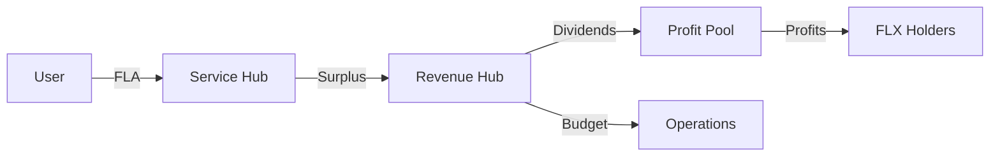

# Revenue & Settlement Bridge

## 1. The Bridge Mechanism
Service usage fees generated in the Sovereign Network must be bridged from user-local routers to the global Consensus Layer settlement pools.

## 2. SovereignRewards: The Gateway
The `SovereignRewards.sol` is the primary entry point for all dimensional revenue.
- **Fee Collection**: Accepts `FLA` (or other dimensional credits) from user applications.
- **Burn-on-Swap**: A percentage of swapped governance tokens (FLX) are burned here to manage long-term supply.
- **Revenue Routing**: Automatically transfers the protocol surplus (Zakat/Tax) to the `SovereignRevenueHub`.

## 3. SovereignRevenueHub: The Allocator
Once revenue reaches the Revenue Hub, it is split according to pre-defined governance parameters:
- **Operations (Ops)**: Funds for network maintenance and auditor rewards.
- **R&D**: Budget for protocol evolution and edge-case verifier development.
- **Profit Pool**: The final destination for net surplus.

## 4. SovereignProfitPool: The Dividend Hub
The Profit Pool is where the **Mudarabah** principle is finalized.
- **Stake Tracking**: Tracks the `FLX` stake of users.
- **Yield Calculation**: Distributes rewards proportionally to participants.
- **Withdrawal**: Users can claim their share of the profit-sharing distribution in native ETH or FLX.

## 5. Settlement Flow Diagram

