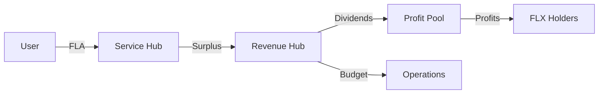

# Revenue & Settlement Bridge

## 1. The Bridge Mechanism
Service usage fees generated in the Sovereign Network must be bridged from user-local routers to the global Consensus Layer settlement pools.

## 2. Revenue Collection
The `SovereignRevenueHub.sol` is the central clearing house for all protocol income.
- **Entry Points**: Receives native assets (ETH) from user subscriptions and service fees.
- **Mudarabah Model**: Revenue is split programmatically to ensure fair distribution.

## 3. SovereignRevenueHub: The Allocator
Incoming revenue is split according to fixed governance parameters:
- **Operations (50%)**: Directs funds for server upkeep, auditor incentives, and core development.
- **Profit Sharing (30%)**: Forwarded to the `SovereignProfitPool` for FLX stakers.
- **R&D (20%)**: Reserved for protocol research, grant programs, and edge-case verifier development.

## 4. SovereignProfitPool: The Dividend Hub
The Profit Pool is where the **Mudarabah** principle is finalized.
- **Stake Tracking**: Tracks the `FLX` stake of users.
- **Yield Calculation**: Distributes rewards proportionally to participants.
- **Withdrawal**: Users can claim their share of the profit-sharing distribution in native ETH or FLX.

## 5. Settlement Flow Diagram

