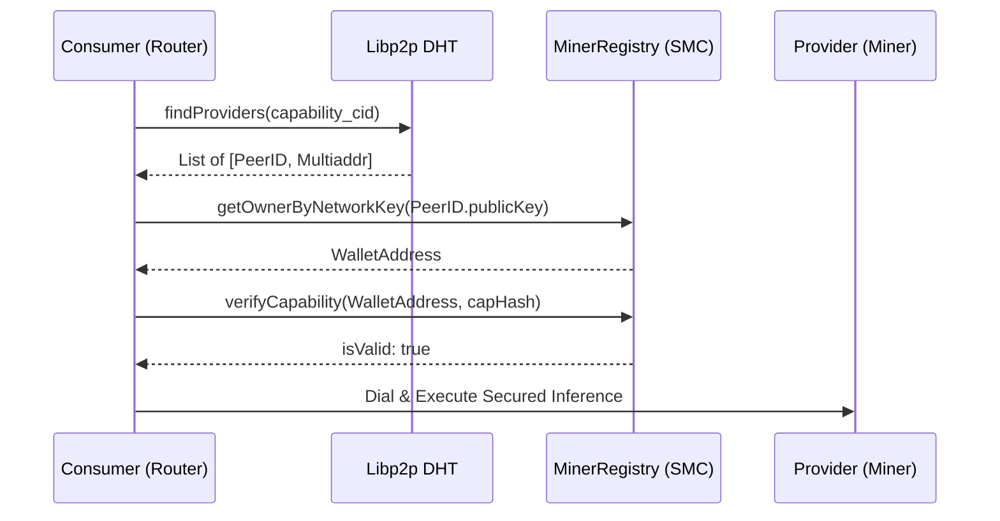

# Sovereign Multidimensional Chain (SMC)

## 1. The Scaling Thesis: Dimensional Isolation
Linear blockchains suffer from "resource contention"—where a spike in NFT trading increases the cost of AI inference. FlexIA solves this via **SMC**, where each resource type operates in its own dedicated economic dimension.

## 2. Core Architecture
The SMC is governed by the **Sovereign Hyper-Hub (Root)** which manages the dimensional registry.

### A. The Hyper-Hub
The central anchor that connects governance (FLX) to utility (Dimensions).
- **Liquidity Routing**: Facilitates swaps between native tokens and dimensional credits.
- **Authority Delegation**: Manages the list of approved Verifiers for different dimensions.

### B. Dimension Nodes (Parallel Economies)
Each dimension (AI, VPN, Storage) has its own isolated:
1. **Contract Logic**: Specialized for the resource (e.g., `SovereignAIDimension.sol`).
2. **Reputation Pool**: Independent scoring based on resource-specific performance metrics.
3. **Reward Token**: Native accounting units like **FLA (AI Credit)** or **FLV (VPN Credit)**.

## 3. Dimensional Settlement Logic
The settlement process follows the **Mudarabah** principle through specialized gateways:

- **SovereignRewards**: The bridge that collects service fees in dimensional tokens (FLA) and routes them to the Revenue Hub.
- **SovereignRevenueHub**: Splits incoming revenue between operations, R&D, and the Profit Pool.
- **SovereignProfitPool**: Distributes profits back to FLX holders based on productive contribution.

## 4. Why SMC?
- **Economic Resilience**: Pricing AI inference is decoupled from the volatility of high-traffic VPN usage.
- **Security Specificity**: A vulnerability in one resource-verifier cannot drain the rewards of another dimension.
- **Infinite Horizontal Scale**: New resource types (e.g., decentralized rendering, DNA sequencing) can be added as new dimensions without altering the root protocol.

## 4. Dimensional Trust & Identity (Phase 6 Implementation)

FlexIA implemented a **"Trust-but-Verify"** discovery protocol that anchors transient P2P identities to persistent blockchain wallets.

### A. On-Chain Identity Resolution
Every sovereign node registers its ephemeral P2P identity on the `MinerRegistry`. This allows any network participant to resolve a PeerID back to a wallet address for reputation and capability verification.

- **Mapping**: `networkKeyToOwner(bytes32 networkKey) -> address owner`
- **Verification**: `verifyCapability(address miner, bytes32 capHash) -> bool`

### B. Hardware Attestation Protocol
Nodes advertise resources via the DHT. Before establishing a high-value route, the consumer verifies the provider's hardware attestation.
1. **Discovery**: Consumer finds providers for `gpu-rtx4090` via Kad-DHT.
2. **Handshake**: Consumer retrieves the provider's P2P Public Key.
3. **Resolution**: Resolves Key to Wallet Address via `networkKeyToOwner`.
4. **Verification**: Checks the `minerCapabilities` mapping on-chain for a verified attestation proof.

### C. Secure Dimensional Handshake

## 5. Future Evolution: Recursive Settlement (Phase 7)
The next stage of SMC evolution involves **Recursive Settlement**, where dimensional credits can be autonomously swapped and attested across parallel chains, enabling global liquidity for specialized compute resources.
